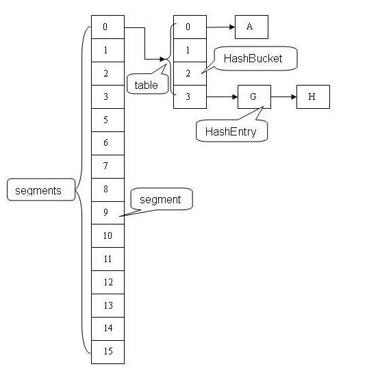
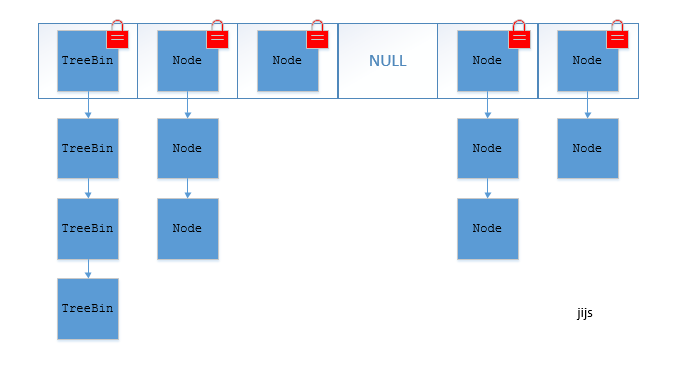

1. 为什么要用ConcurrentHashMap

    HashMap线程不安全，而Hashtable是线程安全，但是它使用了synchronized进行方法同步，插入、读取数据都使用了synchronized，当插入数据的时候不能进行读取（相当于把整个Hashtable都锁住了，全表锁），当多线程并发的情况下，都要竞争同一把锁，导致效率极其低下。而在JDK1.5后为了改进Hashtable的痛点，ConcurrentHashMap应运而生。

1. ConcurrentHashMap为什么高效？
    
    1. JDK1.5中的实现
    
        ConcurrentHashMap使用的是分段锁技术,将ConcurrentHashMap将锁一段一段的存储，然后给每一段数据配一把锁（segment），当一个线程占用一把锁（segment）访问其中一段数据的时候，其他段的数据也能被其它的线程访问，默认分配16个segment。默认比Hashtable效率提高16倍。
        
        ConcurrentHashMap的结构图如下（网友贡献的图，哈）：
        
        
        
    1. JDK1.8中的实现
        
        ConcurrentHashMap取消了segment分段锁，而采用CAS和synchronized来保证并发安全。数据结构跟HashMap1.8的结构一样，数组+链表/红黑二叉树。
        synchronized只锁定当前链表或红黑二叉树的首节点，这样只要hash不冲突，就不会产生并发，效率又提升N倍。
        
        JDK1.8的ConcurrentHashMap的结构图如下：
        
        
        
        