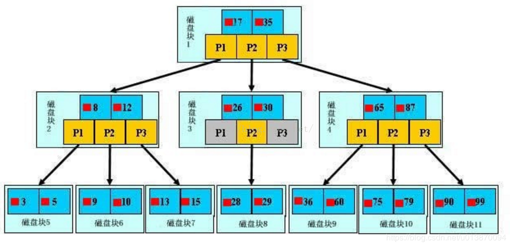

常用的两种索引结构：B-tree和HASH

B-tree

  B-tree索引能够加快访问数据的速度，因为存储引擎不再需要经行全表扫描来获取需要的数据，取而代之的是从根节点开始搜索。根节点的槽中存放了指向子节点的指针，存储引擎根据这些指针向下查找。通常比较节点页的值和要查找的值可以找到合适的指针进入下层子节点。

B-tree通常意味着所有的值都是按顺序存储的，并且每一个叶子页到根的距离相同。

如上图，是一颗B-tree，关于B-tree的定义可以参见B-tree，这里只说一些重点，浅蓝色的块我们称之为一个磁盘块，可以看到每个磁盘块包含几个数据项（深蓝色所示）和指针（黄色所示），如磁盘块1包含数据项17和35，包含指针P1、P2、P3，P1表示小于17的磁盘块，P2表示在17和35之间的磁盘块，P3表示大于35的磁盘块。真实的数据存在于叶子节点即3、5、9、10、13、15、28、29、36、60、75、79、90、99。非叶子节点只不存储真实的数据，只存储指引搜索方向的数据项，如17、35并不真实存在于数据表中。

B-tree的查找过程

  如图所示，如果要查找数据项29，那么首先会把磁盘块1由磁盘加载到内存，此时发生一次IO，在内存中用二分查找确定29在17和35之间，锁定磁盘块1的P2指针，内存时间因为非常短（相比磁盘的IO）可以忽略不计，通过磁盘块1的P2指针的磁盘地址把磁盘块3由磁盘加载到内存，发生第二次IO，29在26和30之间，锁定磁盘块3的P2指针，通过指针加载磁盘块8到内存，发生第三次IO，同时内存中做二分查找找到29，结束查询，总计三次IO。真实的情况是，3层的B-tree可以表示上百万的数据，如果上百万的数据查找只需要三次IO，性能提高将是巨大的，如果没有索引，每个数据项都要发生一次IO，那么总共需要百万次的IO，显然成本非常非常高。

B-tree性质

通过上面的分析，我们知道IO次数取决于b+数的高度h，假设当前数据表的数据为N，每个磁盘块的数据项的数量是m，则有h=㏒(m+1) N，当数据量N一定的情况下，m越大，h越小；而m = 磁盘块的大小 / 数据项的大小，磁盘块的大小也就是一个数据页的大小，是固定的，如果数据项占的空间越小，数据项的数量越多，树的高度越低。这就是为什么每个数据项，即索引字段要尽量的小，比如int占4字节，要比bigint8字节少一半。这也是为什么B-tree要求把真实的数据放到叶子节点而不是内层节点，一旦放到内层节点，磁盘块的数据项会大幅度下降，导致树增高。当数据项等于1时将会退化成线性表。
当B-tree的数据项是复合的数据结构，比如(name,age,sex)的时候，b+数是按照从左到右的顺序来建立搜索树的，比如当(张三,20,F)这样的数据来检索的时候，B-tree会优先比较name来确定下一步的所搜方向，如果name相同再依次比较age和sex，最后得到检索的数据；但当(20,F)这样的没有name的数据来的时候，B-tree就不知道下一步该查哪个节点，因为建立搜索树的时候name就是第一个比较因子，必须要先根据name来搜索才能知道下一步去哪里查询。比如当(张三,F)这样的数据来检索时，B-tree可以用name来指定搜索方向，但下一个字段age的缺失，所以只能把名字等于张三的数据都找到，然后再匹配性别是F的数据了， 这个是非常重要的性质，即索引的最左匹配特性。

注意：B-tree的高度一般都在2-4层，这也就是说查找某一键值的行记录最多只要2到4次IO，花费0.02-0.04秒左右。B-tree索引适用于全值匹配、匹配最左前缀、匹配列前缀、匹配范围值

Hash索引

Hash索引只能用于对等比较，例如=,<=>（相当于=）操作符。由于是一次定位数据，不像BTree索引需要从根节点到枝节点，最后才能访问到页节点这样多次IO访问，所以检索效率远高于BTree索引。 

但为什么我们使用BTree比使用Hash多呢？主要Hash本身由于其特殊性，也带来了很多限制和弊端： 

1. Hash索引仅仅能满足“=”,“IN”,“<=>”查询，不能使用范围查询。 

2. 联合索引中，Hash索引不能利用部分索引键查询。 

对于联合索引中的多个列，Hash是要么全部使用，要么全部不使用，并不支持BTree支持的联合索引的最优前缀，也就是联合索引的前面一个或几个索引键进行查询时，Hash索引无法被利用。 

3. Hash索引无法避免数据的排序操作 

由于Hash索引中存放的是经过Hash计算之后的Hash值，而且Hash值的大小关系并不一定和Hash运算前的键值完全一样，所以数据库无法利用索引的数据来避免任何排序运算。 

4. Hash索引任何时候都不能避免表扫描 

Hash索引是将索引键通过Hash运算之后，将Hash运算结果的Hash值和所对应的行指针信息存放于一个Hash表中，由于不同索引键存在相同Hash值，所以即使满足某个Hash键值的数据的记录条数，也无法从Hash索引中直接完成查询，还是要通过访问表中的实际数据进行比较，并得到相应的结果。 

5. Hash索引遇到大量Hash值相等的情况后性能并不一定会比BTree高 

对于选择性比较低的索引键，如果创建Hash索引，那么将会存在大量记录指针信息存于同一个Hash值相关联。这样要定位某一条记录时就会非常麻烦，会浪费多次表数据访问，而造成整体性能底下。

 

Hash索引

所谓Hash索引，当我们要给某张表某列增加索引时，将这张表的这一列进行哈希算法计算，得到哈希值，排序在哈希数组上。所以Hash索引可以一次定位，其效率很高，而Btree索引需要经过多次的磁盘IO，但是innodb和myisam之所以没有采用它，是因为它存在着好多缺点：

1、因为Hash索引比较的是经过Hash计算的值，所以只能进行等式比较，不能用于范围查询

1、每次都要全表扫描

2、由于哈希值是按照顺序排列的，但是哈希值映射的真正数据在哈希表中就不一定按照顺序排列，所以无法利用Hash索引来加速任何排序操作

3、不能用部分索引键来搜索，因为组合索引在计算哈希值的时候是一起计算的。

4、当哈希值大量重复且数据量非常大时，其检索效率并没有Btree索引高的。

建立索引的原则

1. 最左前缀匹配原则，非常重要的原则，mysql会一直向右匹配直到遇到范围查询(>、<、between、like)就停止匹配，比如a = 1 and b = 2 and c > 3 and d = 4 如果建立(a,b,c,d)顺序的索引，d是用不到索引的，如果建立(a,b,d,c)的索引则都可以用到，a,b,d的顺序可以任意调整。
2. =和in可以乱序，比如a = 1 and b = 2 and c = 3 建立(a,b,c)索引可以任意顺序，mysql的查询优化器会帮你优化成索引可以识别的形式。
3. 尽量选择区分度高的列作为索引,区分度的公式是count(distinct col)/count(*)，表示字段不重复的比例，比例越大我们扫描的记录数越少，唯一键的区分度是1，而一些状态、性别字段可能在大数据面前区分度就是0，那可能有人会问，这个比例有什么经验值吗？使用场景不同，这个值也很难确定，一般需要join的字段我们都要求是0.1以上，即平均1条扫描10条记录。
4. 索引列不能参与计算，保持列“干净”，比如from_unixtime(create_time) = ’2014-05-29’就不能使用到索引，原因很简单，b+树中存的都是数据表中的字段值，但进行检索时，需要把所有元素都应用函数才能比较，显然成本太大。所以语句应该写成create_time = unix_timestamp(’2014-05-29’);
5. 尽量的扩展索引，不要新建索引。比如表中已经有a的索引，现在要加(a,b)的索引，那么只需要修改原来的索引即可。
6. 不能过度索引：在修改表内容的时候，索引必须更新或者重构，所以索引过多时，会消耗更多的时间。
7. 不同值较少的列不必要建立索引（性别）。

深度分析
[MySQL InnoDB索引原理和算法](https://segmentfault.com/a/1190000019130880)
