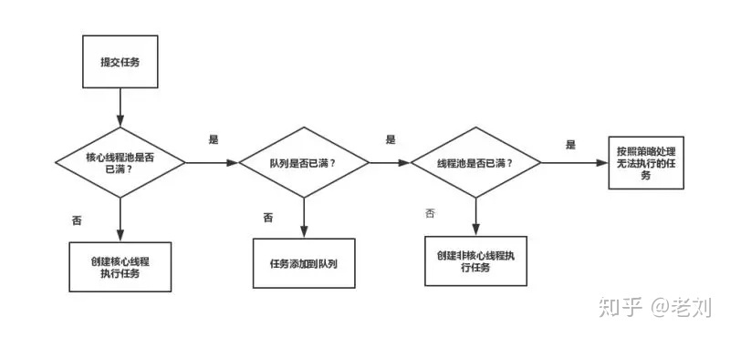
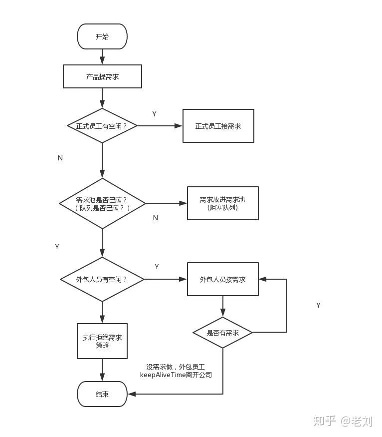

线程池概念

线程池： 简单理解，它就是一个管理线程的池子。

1. 它帮我们管理线程，避免增加创建线程和销毁线程的资源损耗。因为线程其实也是一个对象，创建一个对象，需要经过类加载过程，销毁一个对象，需要走GC垃圾回收流程，都是需要资源开销的。
1. 提高响应速度。 如果任务到达了，相对于从线程池拿线程，重新去创建一条线程执行，速度肯定慢很多。
1. 重复利用。 线程用完，再放回池子，可以达到重复利用的效果，节省资源。

线程池的创建

线程池可以通过ThreadPoolExecutor来创建，我们来看一下它的构造函数：

public ThreadPoolExecutor(int corePoolSize, int maximumPoolSize,long keepAliveTime,TimeUnit unit,
   BlockingQueue<Runnable> workQueue,
   ThreadFactory threadFactory,
   RejectedExecutionHandler handler) 
几个核心参数的作用：

corePoolSize： 线程池核心线程数最大值
maximumPoolSize： 线程池最大线程数大小
keepAliveTime： 线程池中非核心线程空闲的存活时间大小
unit： 线程空闲存活时间单位
workQueue： 存放任务的阻塞队列
threadFactory： 用于设置创建线程的工厂，可以给创建的线程设置有意义的名字，可方便排查问题。
handler： 线城池的饱和策略事件，主要有四种类型。

任务执行

线程池执行流程，即对应execute()方法：

+ 提交一个任务，线程池里存活的核心线程数小于线程数corePoolSize时，线程池会创建一个核心线程去处理提交的任务。
+ 如果线程池核心线程数已满，即线程数已经等于corePoolSize，一个新提交的任务，会被放进任务队列workQueue排队等待执行。
+ 当线程池里面存活的线程数已经等于corePoolSize了,并且任务队列workQueue也满，判断线程数是否达到maximumPoolSize，即最大线程数是否已满，如果没到达，创建一个非核心线程执行提交的任务。
+ 如果当前的线程数达到了maximumPoolSize，还有新的任务过来的话，直接采用拒绝策略处理。

四种拒绝策略

+ AbortPolicy(抛出一个异常，默认的)
+ DiscardPolicy(直接丢弃任务)
+ DiscardOldestPolicy（丢弃队列里最老的任务，将当前这个任务继续提交给线程池）
+ CallerRunsPolicy（交给线程池调用所在的线程进行处理)
为了形象描述线程池执行，我打个比喻：

核心线程比作公司正式员工
非核心线程比作外包员工
阻塞队列比作需求池
提交任务比作提需求

+ 当产品提个需求，正式员工（核心线程）先接需求（执行任务）
+ 如果正式员工都有需求在做，即核心线程数已满），产品就把需求先放需求池（阻塞队列）。
+ 如果需求池(阻塞队列)也满了，但是这时候产品继续提需求,怎么办呢？那就请外包（非核心线程）来做。
+ 如果所有员工（最大线程数也满了）都有需求在做了，那就执行拒绝策略。
+ 如果外包员工把需求做完了，它经过一段（keepAliveTime）空闲时间，就离开公司了。

好的，到这里。面试问题1->Java的线程池说一下，各个参数的作用，如何进行的? 是否已经迎刃而解啦， 我觉得这个问题，回答：线程池构造函数的corePoolSize,maximumPoolSize等参数，并且能描述清楚线程池的执行流程 就差不多啦。

